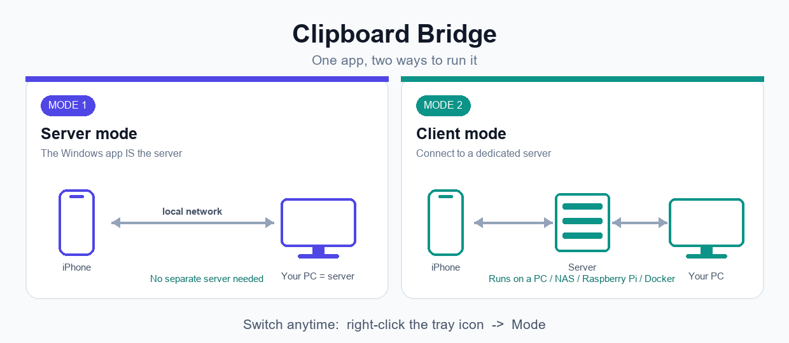

# Clipboard Bridge - Sincronizzazione appunti tra Windows e iPhone

[English](README.md) · **Italiano**

[Sito web](https://mattbox03.github.io/Clipboard-Bridge/) ·
[Download Windows](https://github.com/mattbox03/Clipboard-Bridge/releases) ·
[App Store del server](https://github.com/mattbox03/Clipboard-Bridge-AppStore)

**Windows 2.0.1:** [Installer, senza privilegi amministratore](https://github.com/mattbox03/Clipboard-Bridge/releases/download/2.0.1/Clipboard.Bridge_windows_client_and_server_setup_x64_V2.0.1.exe) ·
[Portable, senza installazione o privilegi amministratore](https://github.com/mattbox03/Clipboard-Bridge/releases/download/2.0.1/Clipboard.Bridge.Portable.Windows.x64.V2.0.1.exe)

> **Sincronizzazione automatica su Windows:** questa avvertenza vale sia per la versione
> installer sia per la portable. Windows può impedire a Clipboard Bridge di rilevare le
> modifiche agli appunti effettuate da programmi avviati come amministratore. Se l'auto-sync
> non funziona, fai clic destro su Clipboard Bridge e scegli **Esegui come amministratore**.


Condividi gli appunti — testo, immagini e **file di qualsiasi tipo** — tra **Windows e
iPhone** in rete locale, tramite l'app Comandi rapidi (Shortcuts). Niente cloud, niente
account. Interfaccia in **inglese (predefinita)** e in italiano.

## ⚡ Funziona in due modalità distinte



Si cambia quando vuoi dall'icona nella tray (**clic destro → Modalità**):

| | 🖥️ Modalità Server | 🔌 Modalità Client |
|---|---|---|
| **Chi fa da server** | la **stessa app Windows** | un **server a parte** (PC, NAS, Raspberry Pi, Docker) |
| **L'iPhone si connette a** | il tuo PC, direttamente | il server |
| **Configurazione extra** | nessuna — basta l'interruttore | far girare il server da qualche parte |
| **Pagina web** | no (minimale) | sì |
| **Ideale per** | PC ↔ iPhone al volo, zero setup | sempre disponibile, anche a PC spento o anche tra molteplici PC |

> 📖 **Prima volta?** Segui la [guida passo-passo](GUIDE.md) (in inglese).

**Clipboard Bridge è uno strumento open source e self-hosted per sincronizzare gli
appunti e trasferire file tra Windows e iPhone.** Può funzionare direttamente sul PC
Windows oppure collegare più dispositivi a un server privato Flask e Docker. Trasferisce
l'ultimo elemento degli appunti in rete locale senza dipendere da iCloud, Appunti cloud
di Microsoft o servizi cloud esterni.

## Funzionalità
- Scambio di **testo, immagini e file** di qualsiasi tipo.
- **Cronologia** sul server e sul client.
- **Client Windows** nella tray: invio/ricezione e scorciatoie da tastiera globali.
- **Ricezione automatica dei file:** PDF e altri file nuovi vengono scaricati mentre il
  client è attivo; cliccando la notifica di Windows viene mostrato il file.
- **Interfaccia web** del server (utilizzabile anche dal browser dell'iPhone) per
  incollare testo e caricare/scaricare file.
- Integrazione con le **Shortcuts iPhone** tramite semplici richieste HTTP.
- **Nessun server a parte (opzionale):** l'app Windows può fare da server (tray → **Modalità → Server**),
  così l'iPhone si connette direttamente al tuo PC.
- **Token** opzionale per l'API e **password** opzionale per la pagina web.
- Server eseguibile direttamente oppure in **Docker**.


## Utilizzi principali

- **Sincronizzare gli appunti tra Windows e iPhone** con due Comandi rapidi iOS.
- **Inviare foto e file da iPhone a un PC Windows** tramite Wi-Fi.
- **Copiare testo da Windows e incollarlo su iOS**, oppure ricevere su Windows gli
  appunti copiati su iPhone.
- Creare un **server clipboard self-hosted** su NAS, Raspberry Pi, home server o Docker.
- Usare **Windows come server degli appunti** senza avere un NAS o un server separato.
- Condividere un server tra più persone usando **account clipboard isolati**.
- Tenere appunti e file all'interno di una **rete locale privata**.

## Struttura del repository

| File | Descrizione |
|------|-------------|
| `clipboard_bridge-Server.py` | server (Flask): API, interfaccia web, storico |
| `clipboard_bridge_windows.py` | client Windows (icona nella tray) |
| `Dockerfile`, `docker-compose.yml` | esecuzione del server in container |
| `requirements-server.txt`, `requirements-client.txt` | dipendenze |
| `build_client.bat` | compila il client in un singolo `.exe` |
| `build_windows_release.bat` | crea EXE portable e installer Windows |
| `Clipboard_Bridge_setup.iss` | definizione universale dell'installer Inno Setup |
| `icon.ico` | icona dell'applicazione |

> Scarica l'installer o il portable già verificati dalle Release. Il file tracciato
> `dist\Clipboard Bridge.exe` può anche essere ricompilato con gli script descritti sotto.

---

## 1. Server

### Installazione dagli App Store

Il server viene distribuito anche tramite il catalogo separato
**[Clipboard Bridge App Store](https://github.com/mattbox03/Clipboard-Bridge-AppStore)**.
Nel relativo README trovi istruzioni dettagliate per installazione e aggiornamento su:

- **ZimaOS** con installazione in un clic
- **Portainer** tramite App Templates
- **Umbrel** come Community App Store
- **Runtipi** come app personalizzata
- **Docker Compose**, Docker Desktop e Dockge

Apri la **[guida italiana del catalogo](https://github.com/mattbox03/Clipboard-Bridge-AppStore/blob/main/README.it.md)**
e segui la sezione dedicata alla tua piattaforma. La sorgente permanente per
ZimaOS è:

```text
https://github.com/mattbox03/Clipboard-Bridge-AppStore/archive/refs/heads/main.zip
```

### Esecuzione diretta
```bash
pip install -r requirements-server.txt
python clipboard_bridge-Server.py
```
Il server ascolta su tutte le interfacce, porta **5088**. Apri `http://localhost:5088/`
nel browser per l'interfaccia web.

### Docker
```bash
docker compose up -d --build
```
La cronologia resta nella cartella `./data` e sopravvive ai riavvii. Funziona in
qualsiasi ambiente Docker.

Immagine server stabile: `ghcr.io/mattbox03/clipboard-bridge-server:1.0.1`.

Per i dettagli sui container, i backup e i tag delle immagini, consulta
[Installazione Docker e app store](DOCKER.md).

### Opzioni (variabili d'ambiente)

| Variabile | Default | Descrizione |
|-----------|---------|-------------|
| `CLIPBOARD_PORT` | `5088` | porta di ascolto |
| `CLIPBOARD_TOKEN` | *(vuoto)* | se impostato, l'API (`/clipboard/*`) richiede l'header `X-Auth-Token` |
| `CLIPBOARD_PASSWORD` | *(vuoto)* | se impostato, la pagina web richiede il login (sessione lunga per dispositivo) |
| `CLIPBOARD_ACCOUNTS` | *(vuoto)* | account isolati aggiuntivi, formato `user1:pass1,user2:pass2` (vedi sotto) |
| `CLIPBOARD_ACCOUNTS_FILE` | *(vuoto)* | percorso di un file con un `user:password` per riga (per tanti account) |
| `CLIPBOARD_MAX_HISTORY` | `200` | numero di elementi tenuti nello storico |
| `CLIPBOARD_MAX_UPLOAD_MB` | `64` | dimensione massima di una richiesta o di un file in MB |
| `CLIPBOARD_DATA_DIR` | `./clipboard_data` | cartella dei dati |

> Per l'uso fuori dalla rete locale imposta un token e usa una VPN o un reverse proxy con
> HTTPS. [Tailscale](https://tailscale.com/) è un possibile esempio di VPN: installalo
> sull'iPhone e sul PC/server, poi usa negli Shortcuts l'IP Tailscale del server
> (`http://100.x.y.z:5088`). Non serve esporre la porta 5088 sul router. Sulla rete locale,
> consenti la porta 5088 nel firewall del computer. Funziona anche quando l'app Windows è
> in **modalità Server**: usa l'IP Tailscale di quel PC e la porta configurata nell'app.

### Account multipli (opzionale)

Lo **spazio condiviso** è sempre disponibile. Per aggiungere spazi **isolati** (ognuno con
il proprio storico), imposta `CLIPBOARD_ACCOUNTS`:

```bash
CLIPBOARD_ACCOUNTS="alice:secret1,bob:secret2"
```

**Non c'è alcun limite** al numero di account. Per molti utenti, invece di una variabile
lunghissima usa un **file** di account (un `user:password` per riga, `#` per i commenti) e
indicalo con `CLIPBOARD_ACCOUNTS_FILE`:

```bash
# accounts.txt
alice:secret1
bob:secret2
# ...quanti ne vuoi
```
```bash
CLIPBOARD_ACCOUNTS_FILE=/data/accounts.txt python clipboard_bridge-Server.py
```

Scegli un account aggiungendone le credenziali **alla fine dell'URL** — comodo in una
Shortcut o nel client Windows:

```
http://SERVER_IP:5088/clipboard/latest/raw?user=alice&password=secret1
```

Le credenziali nell'URL restano supportate per i Comandi rapidi iPhone. Come alternativa
facoltativa, altri client API possono usare gli header `X-Clipboard-User` e
`X-Clipboard-Password`.

Dal browser apri `http://SERVER_IP:5088/` ed **esegui il login** (nome utente = account,
oppure lascialo vuoto per lo spazio condiviso). La sessione viene ricordata per dispositivo.
Lo spazio condiviso continua a usare `CLIPBOARD_TOKEN` / `CLIPBOARD_PASSWORD` come prima.

---

## 2. Client Windows

Sostituisci `SERVER_IP` con l'indirizzo del computer su cui gira il server.

### Eseguibile
Scarica l'installer/portable già pronto dalle Release oppure compila il solo client portable
con `build_client.bat` (richiede Python). Otterrai `dist\Clipboard Bridge.exe`, avviabile
senza installazione.

### Da sorgente
```bash
pip install -r requirements-client.txt
python clipboard_bridge_windows.py
```

Compare un'icona nella tray (clic destro per il menu):
- **Invia appunti -> server** / **Ricevi ultimo <- server** (testo, immagini, file).
- **Invia un file...** e **Apri cartella ricevuti**. I nuovi file remoti vengono scaricati
  automaticamente in `%USERPROFILE%\Downloads\Clipboard Bridge`; cliccando la notifica si
  apre Esplora file con il documento ricevuto selezionato.
- **Cronologia...**, **Scorciatoie da tastiera** (default `Ctrl+Alt+C` invia, `Ctrl+Alt+V` riceve).
- **Lingua** (English / Italiano) e **Impostazioni...** (IP, porta, token, account del server).
  Lascia **Account** vuoto per lo spazio condiviso, oppure inserisci nome account + password
  per usare uno spazio isolato.

L'app installata non scrive mai i dati di utilizzo dentro `Program Files`. Configurazione,
cronologia locale, dati della modalità Server ed error log vengono salvati in
`%LOCALAPPDATA%\Clipboard Bridge`. Al primo avvio vengono copiati automaticamente gli
eventuali dati trovati accanto a un vecchio eseguibile.

### Avvio automatico
`Win+R` -> `shell:startup` e metti lì un collegamento all'eseguibile.

---

## 3. Interfaccia web

Aprendo l'indirizzo del server in un browser (anche da iPhone) trovi una pagina da cui
puoi incollare testo, caricare e scaricare file e leggere le istruzioni per le Shortcut.
Con il token: `http://SERVER_IP:5088/?token=IL_TUO_TOKEN`. Aggiungi `?lang=it` per l'italiano.

---

## 4. iPhone (Comandi rapidi)

I Comandi rapidi già pronti sono stati pubblicati come asset nella
[release Clipboard Bridge 2.0.0](https://github.com/mattbox03/Clipboard-Bridge/releases/tag/2.0.0)
e restano compatibili con la versione Windows 2.0.1:

- **[Scarica Load Clipboard](https://github.com/mattbox03/Clipboard-Bridge/releases/download/2.0.0/Load.Clipboard.shortcut)** -
  invia gli appunti attuali dell'iPhone a Clipboard Bridge.
- **[Scarica Download Clipboard](https://github.com/mattbox03/Clipboard-Bridge/releases/download/2.0.0/Download.Clipboard.shortcut)** -
  riceve da Clipboard Bridge l'ultimo elemento salvato.

Apri ogni file `.shortcut` sull'iPhone e sostituisci l'indirizzo server segnaposto con
quello mostrato dall'app Windows o con l'indirizzo del server esterno. Se li hai
attivati, inserisci anche token oppure credenziali dell'account.

### Aggiungere i Comandi rapidi al Centro di Controllo

Per averli nella tendina senza aprire l'app Comandi:

1. Apri il **Centro di Controllo** dell'iPhone e tocca il pulsante **Aggiungi (+)**.
2. Tocca **Aggiungi un controllo**, scegli **Comando rapido**, quindi tocca **Scegli**.
3. Seleziona **Load Clipboard**. Ripeti i passaggi e seleziona **Download Clipboard** per
   aggiungere il secondo controllo.

I due pulsanti permettono così di inviare o ricevere l'ultimo elemento direttamente dal
Centro di Controllo. Consulta anche la [guida Apple](https://support.apple.com/guide/shortcuts/apd06a9201d4/ios).

### Creazione manuale

Crea dei comandi con l'azione **Ottieni contenuto dell'URL**. Se usi un token, aggiungi
l'intestazione `X-Auth-Token`.
- **Invio Generale** - POST to `http://SERVER_IP:5088/clipboard` (Request body : File, File -> Clipboard).
- **Ricezione Generale** - GET contents of `http://SERVER_IP:5088/clipboard/latest/raw`(Method : GET ; Copy "Contents of URL" to clipboard).
- **Invia testo** — POST a `http://SERVER_IP:5088/clipboard/text` (corpo JSON, campo `text`).
- **Ricevi testo** — GET a `http://SERVER_IP:5088/clipboard/text/raw`, poi *Copia negli appunti*.
- **Invia foto/file** — POST a `http://SERVER_IP:5088/clipboard/image` (corpo: File).
- **Ricevi immagine** — GET a `http://SERVER_IP:5088/clipboard/image/latest/raw`, poi *Salva nell'album*.

> Usi un account? Aggiungi semplicemente `?user=NOME&password=PASS` alla fine di ogni URL.

---

## 5. API del server

| Metodo | Endpoint | Descrizione |
|--------|----------|-------------|
| GET | `/health` | stato del server (pubblico) |
| POST | `/clipboard` | salva qualsiasi cosa (testo o binario), tipo rilevato in automatico |
| POST | `/clipboard/text` | salva testo (JSON, form o corpo grezzo) |
| GET | `/clipboard/text/raw` | ultimo testo come text/plain |
| POST | `/clipboard/image` | salva un file/immagine (base64, multipart o binario) |
| GET | `/clipboard/image/latest/raw` | ultima immagine come binario |
| POST | `/clipboard/file` | salva un file (JSON `{filename, data}`) |
| GET | `/clipboard/latest` | ultimo elemento di qualsiasi tipo, contenuto incluso |
| GET | `/clipboard/latest/raw` | ultimo elemento (qualsiasi tipo) come contenuto grezzo |
| GET | `/clipboard/history?limit=N` | elenco dello storico (metadati) |
| GET/DELETE | `/clipboard/item/<id>` | legge o elimina un elemento |
| DELETE | `/clipboard/history` | svuota lo storico |

---

## Compilare i pacchetti Windows

Per creare soltanto l'eseguibile portable:

```bat
build_client.bat
```

Per creare entrambi i file universali da caricare nella Release GitHub:

```bat
build_windows_release.bat 2.0.1
```

Lo script usa PyInstaller e Inno Setup senza includere percorsi o configurazioni personali.
Produce:

```text
Output\Clipboard.Bridge.Portable.Windows.x64.V2.0.1.exe
Output\Clipboard.Bridge_windows_client_and_server_setup_x64_V2.0.1.exe
```

L'installer è per singolo utente: installa il programma in
`%LOCALAPPDATA%\Programs\Clipboard Bridge` e non richiede privilegi di amministratore.
Impostazioni e file ricevuti restano nel profilo dell'utente corrente.

Se mancano gli strumenti di compilazione:

```powershell
winget install --id Python.Python.3.12 --exact
winget install --id JRSoftware.InnoSetup --exact
```

## Domande frequenti

### Posso condividere gli appunti tra Windows e iPhone senza iCloud?

Sì. Clipboard Bridge invia testo, fotografie e file attraverso la rete locale. iPhone
utilizza l'app Comandi rapidi, mentre Windows utilizza il client nella tray.

### Serve obbligatoriamente un server separato?

No. In **modalità Server** l'applicazione Windows riceve direttamente le connessioni
dell'iPhone. In **modalità Client** si collega invece a un server Clipboard Bridge sempre
acceso su Docker, NAS, Raspberry Pi o un altro computer.

### Può trasferire fotografie e file di qualsiasi tipo?

Sì. Gli endpoint unificati e i Comandi rapidi iPhone gestiscono testo, immagini e file
in base all'ultimo elemento salvato sul server.

### Clipboard Bridge è un servizio cloud?

No. È self-hosted ed è progettato principalmente per la rete locale. Un eventuale
accesso remoto deve essere protetto con HTTPS tramite VPN o reverse proxy.

### Quali piattaforme self-hosted sono supportate?

Il server supporta Docker Compose e include istruzioni per ZimaOS, Portainer, Umbrel,
Runtipi, Docker Desktop e Dockge nel
[Clipboard Bridge App Store](https://github.com/mattbox03/Clipboard-Bridge-AppStore).

### Sono supportati più utenti?

Sì. Lo spazio condiviso resta disponibile e si può aggiungere un numero praticamente
illimitato di account protetti da password, ognuno con cronologia e file separati.

## Licenza

Distribuito con licenza [MIT](LICENSE).
